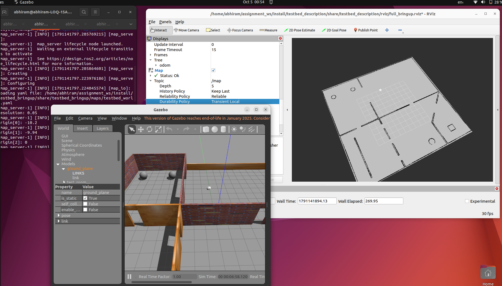
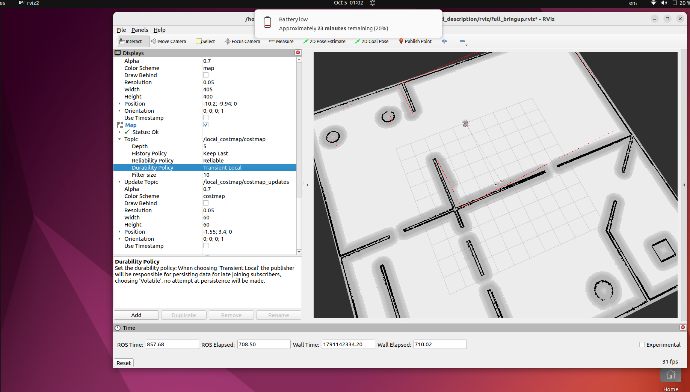
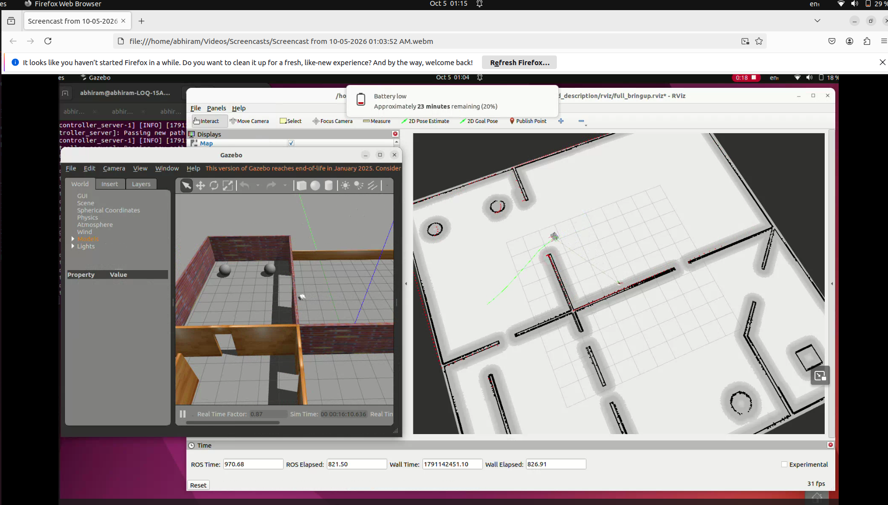

ROS2 Assignment Level 1- Abhiram Pt

# testbed_navigation

Manual Nav2 workflow for the Testbed-T1.0.0 robot (ROS 2 Humble, Gazebo Classic 11).
Map loading, localization and navigation each have their own launch file and are built
directly on the Nav2 plugins, without `nav2_bringup`.

## Package contents

| File | Purpose |
|---|---|
| `launch/map_loader.launch.py` | Runs `map_server` and a lifecycle manager |
| `launch/localization.launch.py` | Runs `amcl` and a lifecycle manager |
| `launch/navigation.launch.py` | Runs `controller_server`, `planner_server`, `behavior_server`, `bt_navigator`, `waypoint_follower` and a lifecycle manager |
| `config/map_server_params.yaml` | Map server parameters |
| `config/amcl_params.yaml` | AMCL parameters |
| `config/nav2_params.yaml` | Costmaps, NavFn planner, DWB controller, BT navigator, behaviors, waypoint follower |

## Prerequisites

- Ubuntu 22.04, ROS 2 Humble, Gazebo 11
- `ros-humble-navigation2`
- `ros-humble-rmw-cyclonedds-cpp`

## Build

```bash
cd ~/assignment_ws
colcon build
source install/setup.bash
```

## Run

Use one terminal per command, in this order. Every terminal needs
`export RMW_IMPLEMENTATION=rmw_cyclonedds_cpp` and `source ~/assignment_ws/install/setup.bash`.

```bash
ros2 launch testbed_bringup testbed_full_bringup.launch.py   # 1. Gazebo + RViz
ros2 launch testbed_navigation map_loader.launch.py          # 2. map
ros2 launch testbed_navigation localization.launch.py        # 3. AMCL
ros2 launch testbed_navigation navigation.launch.py          # 4. navigation
```

In RViz set the Fixed Frame to `map`, add the Map, LaserScan and Path displays, then use
**2D Goal Pose** to send a goal. Use **2D Pose Estimate** if the scan does not line up with the map.

Check that the nodes are active:

```bash
ros2 lifecycle get /map_server
ros2 lifecycle get /amcl
ros2 lifecycle get /bt_navigator
```

## Approach

**Frames and topics.** The diff-drive plugin publishes `odom -> base_footprint`, so every
parameter file uses `base_footprint` as the base frame. Topics are `/scan`, `/odom` and `/cmd_vel`.
AMCL provides `map -> odom`.

**Map loading.** `map_server` loads `testbed_bringup/maps/testbed_world.yaml`. A lifecycle manager
configures and activates it automatically.

**Localization.** AMCL uses the likelihood-field laser model and the differential motion model.
The initial pose is set to the robot's spawn pose (x=0, y=5, yaw=0).

**Navigation.** Only basic functionality is used:
- Global planner: NavFn
- Local controller: DWB (max 0.26 m/s)
- Costmaps: static, obstacle and inflation layers on the global costmap; obstacle and inflation
  layers on a rolling local costmap
- Behaviors: Spin, BackUp, Wait
- Behavior trees: the default Humble trees, with the full list of BT plugin libraries

Laser ranges in the costmaps are 5.0 m (raytrace) and 4.5 m (obstacle), which fit the scan range
of 10 m.

## Bugs in the starter code

All bugs I found and fixed are listed in `BUGS.txt` in the repository root. Beyond the bugs, I changed
two things in the starter code: the lidar `range_max` (1.5 m to 10.0 m, too short to localize on a
20 m map) and `use_sim_time` on `robot_state_publisher`.

## Challenges and how I solved them

1. **Nodes could not start: `librmw_cyclonedds_cpp.so` not found.** Cyclone DDS was not installed.
   Installing `ros-humble-rmw-cyclonedds-cpp` fixed it, and the same
   `RMW_IMPLEMENTATION` must be exported in every terminal.
2. **`gzserver` died on startup (exit code 255), so the robot could not spawn.** A stale Gazebo
   process was still running. Killing `gzserver` and `gzclient` before relaunching fixed it.
3. **`bt_navigator` failed to activate: `Node not recognized: RemovePassedGoals`.** The
   `plugin_lib_names` list replaces the default list, so my short list was missing libraries that the
   default behavior tree needs. I replaced it with the full Humble list. Three names did not exist in my
   install, which I found by checking `/opt/ros/humble/lib`, and one was misspelled
   (`nav2_globally_updated_goal_condition_bt_node`). I confirmed that `ClearEntireCostmap`, which
   the default tree uses, is registered by `nav2_clear_costmap_service_bt_node`.
4. **Gazebo looked frozen while RViz showed the robot moving.** The Gazebo GUI had stopped
   updating. `gz model -m testbed -p` returned the same pose as `/odom` and it changed
   after driving, so the physics was running. Restarting `gzclient` fixed the display.

## Results





Video: [RobotNavigation.webm](../docs/RobotNavigation.webm)

## Possible improvements

- Add `velocity_smoother` and `collision_monitor`
- Tune the DWB critics and the robot footprint
- Provide one combined launch file that starts all three stages
